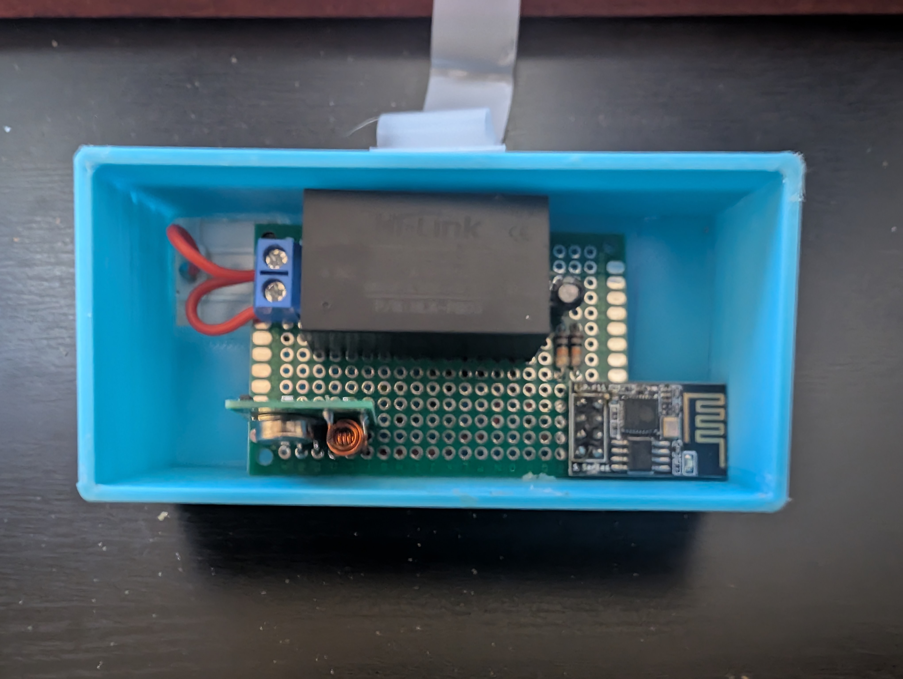
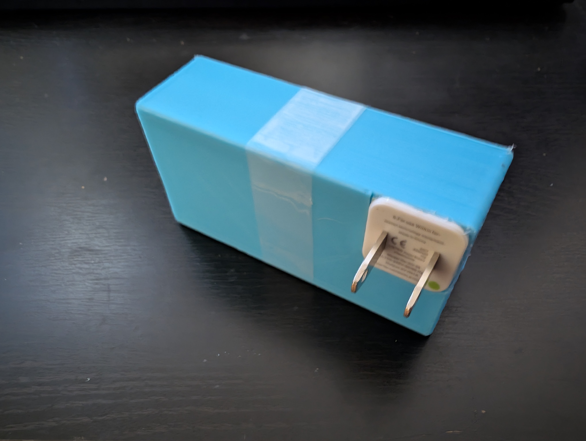
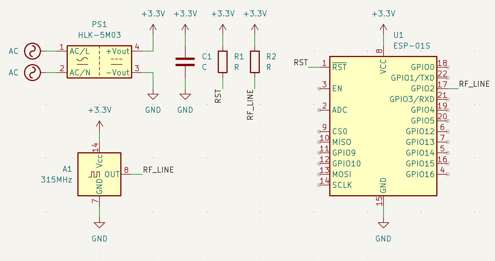

# 315 MHz ESPHome Fireplace Remote

Remote code reversing project that allows me to control my fireplace through Home Assistant with an ESP8266 and a cheap 315 MHz transmitter module and a simple ESPHome setup. Below you can see the small circuit I put together using a 3.3v Hi-Link power supply, an ESP-01s MCU (and required passives), and a 315MHz transmitter module.

## Gathering the Remote Codes

I was able to pull the remote codes using a combination of an oscilloscope hooked up to a 315MHz receiver. I used the oscilloscope to capture several of the possible remote codes.

Upon inspecting the remote codes on the oscilloscope, each remote button press seemed to correspond to several 'bursts' of RF data.

I experimented with several of the export formats on the oscilloscope, but found that exporting the segmented 'bursts' of the signal into individual CSV files worked for this usecase. This way there was enough resolution in the exported data to accurately capture all the signal modulation changes of the remote code.

## Processing the Oscilloscope Data

The produced CSV are were structured in such a manner that each row has a sequence number and a voltage reading from the oscilloscope. There was some header data in the CSV that indicated the duration of each step in the sequence is. I wrote a small script ([`codes/csv2seq.py`](codes/csv2seq.py)) to parse CSV data into a list of signal high/low times.

In accordance with the ESPHome [`remote_transmitter.transmit_raw`](https://esphome.io/components/remote_transmitter.html#remote-transmitter-transmit-raw) api, I setup the script to output the RF data such that 'low' signals are indicated by a negative number and 'high' signals are indicated by a positive numger. The value of the number itself determines the durration of the signal in microseconds.

All of the code 'bursts' seemed to start with some sort of 'ID' string of pulses followed by the actual 'data' of the remote code corresponding to the button press. Most of the codes appeared to be the 'ID' burst followed by the 'data' pulses repeated 8 times with a 30ms gap between the pulse 'bursts'.

## Replaying the Remote Codes

Using the script I was able to convert the oscilloscope CSV data into a pulse format that ESPHome could understand. With that, I was able to construct a yaml file ([`esphome/fireplace.yaml`](esphome/fireplace.yaml)) to compile with ESPHome, install to my basic circuit, and integrate with Home Assistant. With that, I was then able to add a card to my Home Assistant dashboard to allow me to control my fireplace from my phone anywhere in the world I have cell service or wifi.

Below is a screenshot of how the circuit is wired up in the enclosure. The schmatic is captured in a KiCad [schematic](circuit/fireplace.kicad_sch).

